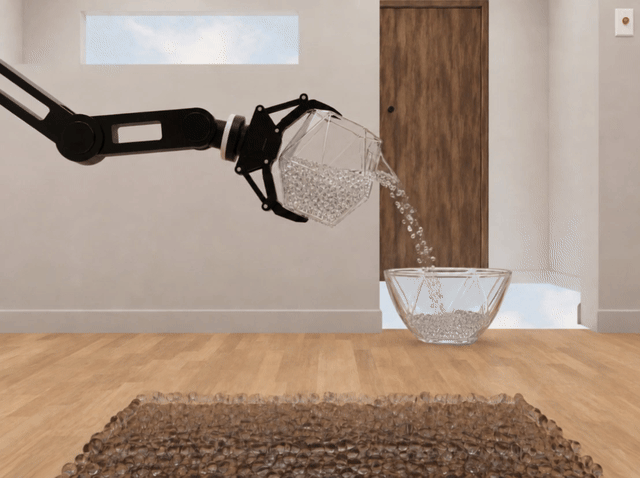
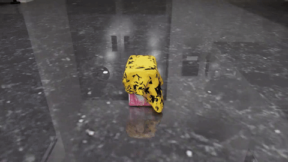
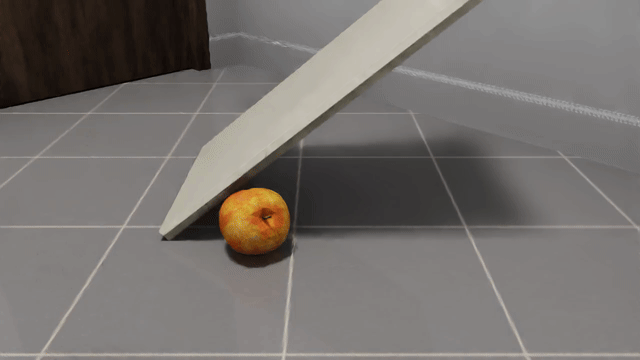
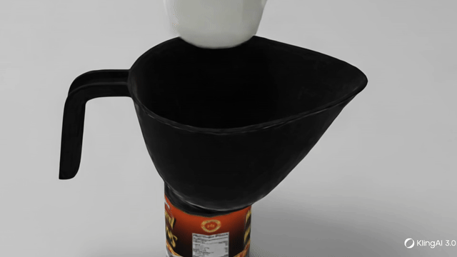
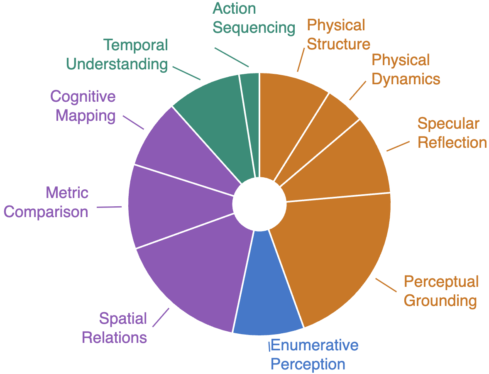
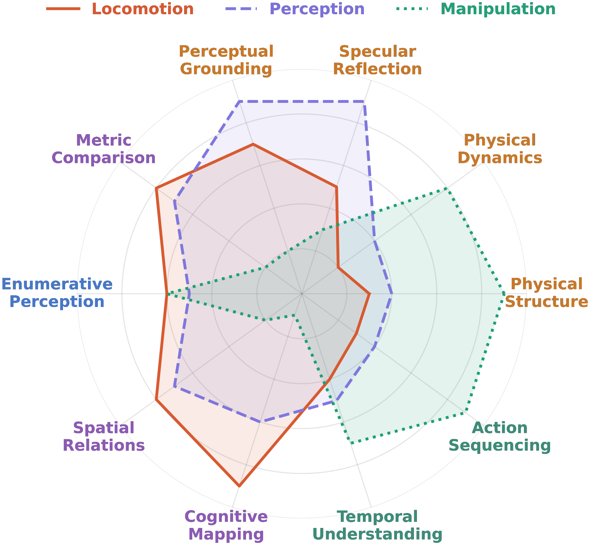

# ESI-Bench: Embodied Spatial Intelligence Benchmark

> **Paper**: [ESI-Bench: Towards Embodied Spatial Intelligence that Closes the Perception–Action Loop](https://esi-bench.github.io/)
> **Authors**: Yining Hong\*, Jiageng Liu\*, Han Yin, Manling Li, Leonidas Guibas, Fei-Fei Li, Jiajun Wu, Yejin Choi
> **Affiliations**: Stanford University, UCLA, Northwestern University
> **Year**: 2026
> **Links**: [Paper](https://esi-bench.github.io/) · [Code](https://esi-bench.github.io/) · [Dataset](https://esi-bench.github.io/)

---

## Overview

ESI-Bench is a comprehensive benchmark for **embodied spatial intelligence** that evaluates agents on their ability to close the **perception–action loop**. Rather than passively processing what is seen, agents must **actively act** to uncover what is unseen — occlusion, dynamics, containment, and functionality — beyond the reach of passive sensing.

### Key Statistics

| Metric | Value |
|--------|-------|
| **Task Categories** | 10 |
| **Subcategories** | 29 |
| **Task Instances** | 3,081 |
| **Simulation Platform** | OmniGibson |
| **Theoretical Grounding** | Spelke's Core Knowledge Systems |

### Teaser


*Agents must actively explore to resolve spatial questions that passive observation alone cannot answer.*

---

## Theoretical Foundation

ESI-Bench is grounded in **Spelke's four core knowledge systems** (Spelke & Kinzler, 2007):

1. **Object Representation** — understanding objects as cohesive, persistent entities
2. **Layout and Geometry** — spatial reasoning about positions, distances, and configurations
3. **Number Representation** — counting, enumeration, and quantity reasoning
4. **Agents and Goal-Directed Actions** — reasoning about intentional behavior and causal chains

---

## Three Departures from Prior Spatial Benchmarks

### 1. From Sensing to Competence

Agents are evaluated not only on what they can perceive, but on whether they know **how to act to perceive it** — closing the loop between observation and action.

### 2. Selective Sensing

Agents must determine which observations are worth acquiring, prioritizing task-relevant information over redundant or uninformative inputs.

### 3. Resolving Perceptual Mirages

Agents must reason through incomplete or misleading observations to infer hidden spatial structures and physical constraints beyond what is directly observed.

---

## Task Categories

### 01. Physical Capacity

Manipulation reveals containment capacity hidden from view.

- **Rigid Containment** — Plan placement of multiple objects across multiple containers.
- **Liquid Volume** — Compare liquid-holding capacity across containers.
- **Deformable Fitting** — Decide whether a deformable container conforms to an object.


*Rigid containment: agent must plan placement of objects across containers.*


*Liquid volume: comparing capacity by pouring and observing.*


*Deformable fitting: determining if a flexible container conforms to an object.*

---

### 02. Physical Dynamics

Predict motion and stability under shape, mass, and geometry.

- **Inclined Plane** — Predict object motion and stability on slopes.
- **Stacking & Stability** — Whether objects stack or balance given shape, mass, and geometry.


*Inclined plane: predicting how objects behave on slopes.*


*Stacking and stability: determining if objects balance given their geometry.*

---

### 03. Specular Reflection

Active repositioning to disambiguate mirror vs. real-world content.

- **Reflection Authoring** — Distinguish real objects from mirror reflections.
- **Spatial Relations** — Infer relations across mirror and real-world views.
- **Correspondence** — Identify which objects appear in the mirror given the real scene.


*Specular reflection: distinguishing real objects from mirror reflections through active repositioning.*

---

### 04. Perceptual Grounding

Repositioning to resolve viewpoint-dependent phenomena.

- **Partial Occlusion** — Reason about objects hidden behind other scene elements.
- **View Hallucination** — Detect objects whose visibility changes critically with viewing angle.
- **Material Transparency** — Reason about objects seen through transparent surfaces.


*Partial occlusion: agent must move to see objects hidden behind others.*

---

### 05. Metric Comparison

Locomotion to overcome forced-perspective distortions.

- **Dimensional Size** — Compare relative sizes of objects across vantage points.
- **Spatial Distance** — Compare relative distances with respect to a reference object.

---

### 06. Enumerative Perception

Counting under occlusion, segmentation, and ambiguity.

- **Counting w/ Occlusion** — Count objects partially obscured by other scene elements.
- **Spatial Segmentation** — Count objects separated across distinct spatial regions.
- **Category Ambiguity** — Count visually similar objects requiring fine-grained distinction.
- **Merged Observation** — Count groups that appear visually merged from a single view.
- **Illumination Variability** — Count objects under challenging or non-uniform lighting.
- **Structural Enclosure** — Count objects hidden within enclosed or covered spaces.


*Enumerative perception: counting objects that are partially occluded or structurally enclosed.*

---

### 07. Spatial Relations

Navigation to vantage points that break projective symmetry.

- **Linear Alignment** — Whether objects are arranged along a common axis.
- **Geometric Configuration** — Identify the shape formed by a set of objects (e.g., equilateral triangle).
- **Physical Contact** — Detect whether two or more objects are in direct contact.


*Spatial relations: determining if objects are aligned along a common axis.*

---

### 08. Cognitive Mapping

Multi-step locomotion to construct topological representations.

- **Topology & Connectivity** — Whether two locations or regions are mutually reachable.
- **Traversable Passage** — Identify navigable corridors or passageways between regions.
- **Regional Boundary** — Identify and delineate distinct functional spatial regions.
- **Long-Term Navigation** — Plan multi-step navigation toward a distant goal.

---

### 09. Temporal Scene

Manipulation and interaction to trigger or observe state changes.

- **Unobserved State Change** — Infer scene changes that occurred during an unobserved interval.
- **Multi-Agent Interaction** — Reason about scene dynamics induced by other agents.

---

### 10. Action Sequencing

Reasoning over ordered actions to determine causal dependencies.

- **Action Order Inference** — Determine the correct procedural ordering of an action sequence.

---

## Task Distribution


*Distribution of the 29 subcategories across Spelke's four core knowledge systems.*

---

## Radar Chart: Capability Dimensions


*Multi-dimensional capability assessment across spatial intelligence faculties.*

---

## Key Findings

### Finding 1: Action Blindness Dominates Perceptual Blindness

> Without explicit instruction, **active agents spontaneously discover emergent spatial strategies** (e.g., move-behind, top-down repositioning, pick-up, pour-out) — driving large gains over passive baselines.

- **Perception is not the bottleneck**: With the right viewpoint, models succeed dramatically. Gemini 3.1 jumps from **14.6% → 95.1%** on Partial Occlusion under oracle views.
- **Passive multi-view adds noise, not signal**: GPT-5 drops from **53.9% to 49.1%** on Spatial Distance despite consuming far more images.
- **Failure cascades**: Suboptimal actions produce uninformative views, which trigger worse subsequent actions — a compounding chain unrecoverable within the step budget (active-to-oracle gap reaches **49.7%** on Structural Enclosure).

### Finding 2: 3D Helps When Geometry Is Perfect — Imperfect Reconstruction Actively Misleads

- **Ground-truth 3D + Gemini** reaches **60.4%** on Material Transparency vs. **44.0%** for 2D Gemini — a **+16.4 pt improvement** on tasks where 2D projections fundamentally lose depth.
- **VGGT-reconstructed scene graphs degrade performance below 2D baselines**: **9.9% vs. 27.5%** on Geometric Configuration, as geometric artifacts distort fine-grained spatial relations.
- **Imperfect 3D grounding is not a neutral failure** — it amplifies errors by feeding the reasoner a corrupted scene graph.

### Finding 3: Models Can See — But Do Not Know When They Have Seen Enough

- **Humans seek viewpoints that falsify their hypothesis**; models seek confirmation and tend to repeat motions in the same direction.
- **Models commit prematurely** with uniformly high confidence, anchoring to first impressions and ignoring contradictory observations.
- **This is a metacognitive failure**, not a perceptual one: neither better perception nor more embodied interaction alone closes the gap.

---

## Results: Active vs Passive vs Oracle (GPT-5)

| Subcategory | Passive Single | Passive Multi | Active | GT Passive |
|-------------|:---:|:---:|:---:|:---:|
| Partial Occlusion | 30.5 | 32.9 | **62.4** | 91.5 |
| View Hallucination | 11.7 | 20.2 | **60.1** | 87.8 |
| Material Transparency | 30.3 | 36.7 | **66.1** | 96.3 |
| Rigid Containment | 45.0 | 42.5 | **42.5** | 95.0 |
| Stacking & Stability | 34.8 | 37.1 | **62.9** | 86.5 |
| Counting w/ Occlusion | 3.3 | 3.3 | **13.3** | 56.7 |
| Structural Enclosure | 5.0 | 10.0 | **22.5** | 67.5 |
| Physical Contact | 40.0 | 41.7 | **64.2** | 90.0 |
| Dimensional Size | 42.5 | 44.9 | **67.7** | 80.3 |
| Unobserved Change | 40.5 | 41.2 | **51.4** | 77.0 |

*Accuracy (%) of GPT-5 across four paradigms on representative subcategories. Active exploration consistently outperforms passive multi-view; the large remaining gap to GT Passive isolates failures of action selection from failures of perception.*

---

## Implications for Autonomous Robotics

### Why ESI-Bench Matters for Embodied AI

1. **Active perception > passive perception**: The benchmark demonstrates that robots must learn *when* and *how* to move, not just what to see. This has direct implications for navigation, manipulation, and exploration policies.

2. **Action blindness is the real bottleneck**: Most failures stem from choosing wrong actions, not from weak perception. This suggests that improving policy/action selection is more impactful than improving perception models.

3. **Failure cascades are real**: Bad actions → bad views → worse actions. This compounding effect is critical for real-world robots operating with limited step budgets.

4. **3D reconstruction is a double-edged sword**: Imperfect 3D can actively mislead. This warns against blindly trusting reconstructed scene graphs in robot planning.

5. **Metacognition gap**: Models don't know when they've seen enough. This has implications for exploration-exploitation tradeoffs in autonomous agents.

### Connection to VLA Models

ESI-Bench directly evaluates the capabilities that Vision-Language-Action (VLA) models need:
- **Spatial reasoning** for manipulation and navigation
- **Active exploration** for information gathering
- **Action sequencing** for multi-step tasks
- **Perceptual grounding** for robust object interaction

### Relevance to World Models

The benchmark highlights the importance of world models that can:
- Predict how observations change as a function of action
- Reason about hidden states and unobserved dynamics
- Simulate the consequences of actions before executing them

---

## Citation

```bibtex
@article{hong2026esibench,
  title = {{ESI-Bench}: Towards Embodied Spatial Intelligence that Closes the Perception-Action Loop},
  author = {Hong, Yining and Liu, Jiageng and Yin, Han and Li, Manling and Guibas, Leonidas and Li, Fei-Fei and Wu, Jiajun and Choi, Yejin},
  journal = {arXiv preprint},
  year = {2026},
  url = {https://esi-bench.github.io/}
}
```

---

*Source: [esi-bench.github.io](https://esi-bench.github.io/)*
