# RoboMME: A Large-Scale Standardized Benchmark for VLA Memory

RoboMME is a large-scale standardized benchmark designed to evaluate and advance Vision-Language-Action (VLA) models in long-horizon, history-dependent robotic manipulation scenarios.

## Overview
Memory is critical for tasks that involve counting repeated actions or manipulating objects that become temporarily occluded. RoboMME addresses the lack of standardized evaluation for memory mechanisms in VLA models.

### Key Contributions
- **Standardized Benchmark**: 16 manipulation tasks across a taxonomy evaluating temporal, spatial, object, and procedural memory.
- **VLA Suite**: 14 memory-augmented VLA variants based on the $\pi 0.5$ backbone to explore memory representations and integration strategies.
- **Findings**: The effectiveness of memory representations is highly task-dependent, with different designs offering distinct advantages.

## Task Taxonomy and Memory
The benchmark evaluates several types of memory:
- **Temporal Memory**: Remembering events over time.
- **Spatial Memory**: Remembering locations of objects.
- **Object Memory**: Remembering properties of objects.
- **Procedural Memory**: Remembering sequences of actions.

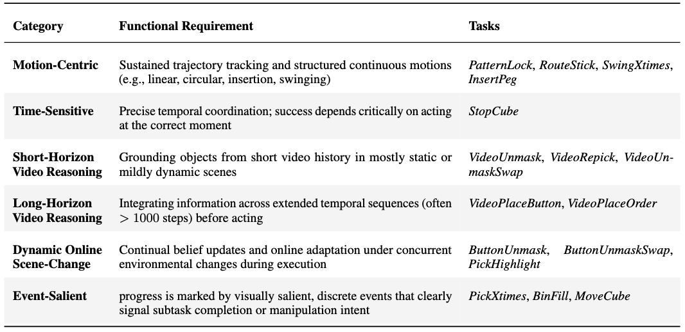
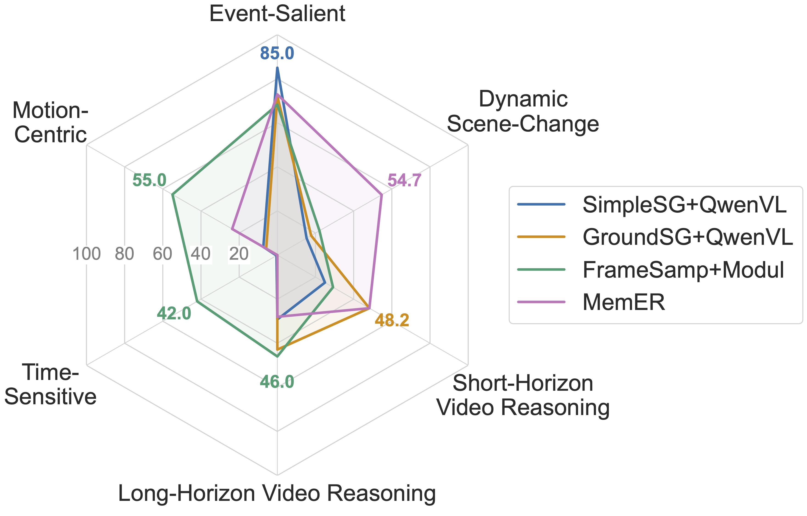

## Model Design
RoboMME explores various memory-augmented VLA architectures.

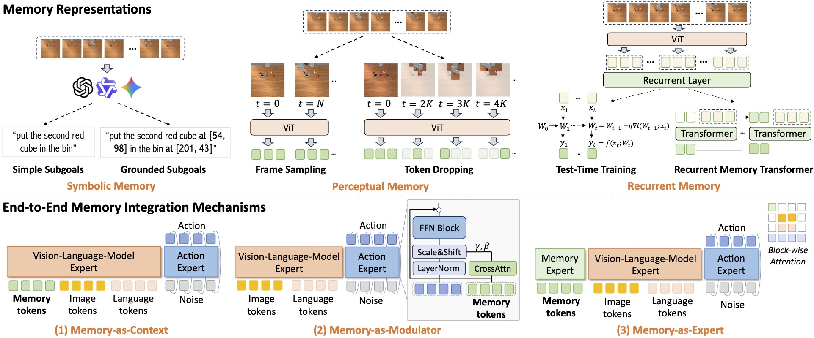
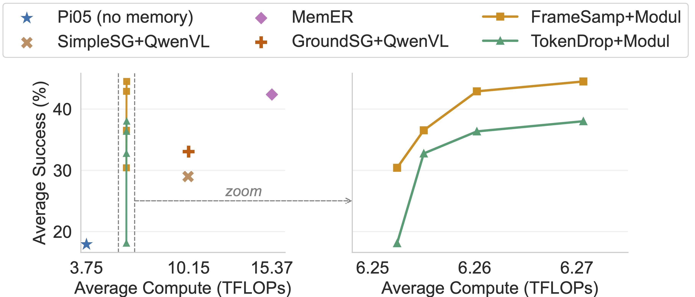

## Results
The suite of memory-augmented VLAs shows varying performance across tasks.

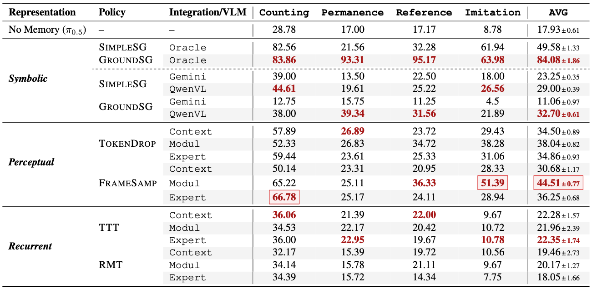

## Demonstrations

### Intro
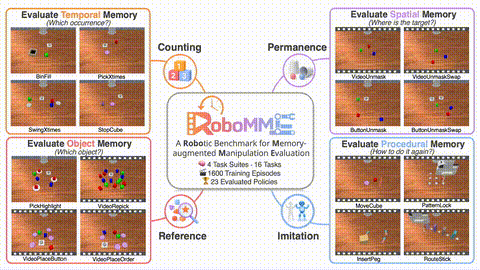

### Tasks
- **Bin Fill**: 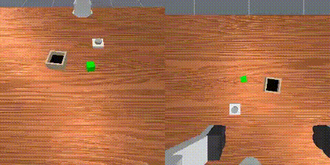
- **Pick X Times**: 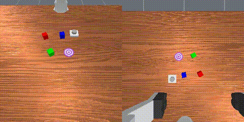
- **Swing X Times**: 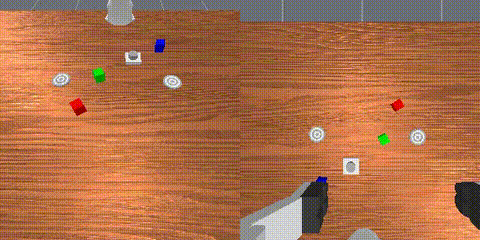
- **Stop Cube**: 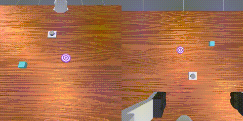
- **Video Unmask**: 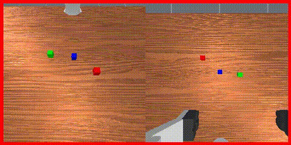
- **Button Unmask**: 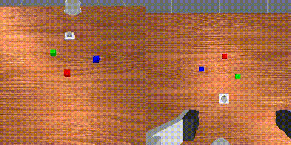
- **Video Unmask Swap**: 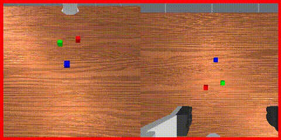
- **Button Unmask Swap**: 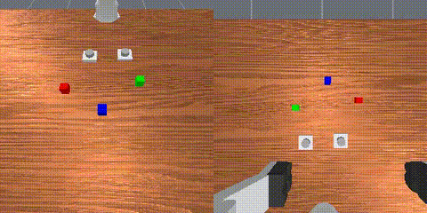
- **Pick Highlight**: 
- **Video Repick**: 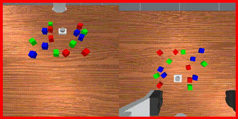
- **Video Place Button**: 
- **Video Place Order**: 
- **Move Cube**: 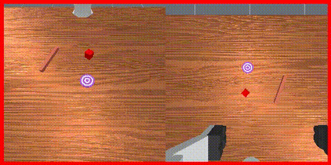
- **Insert Peg**: 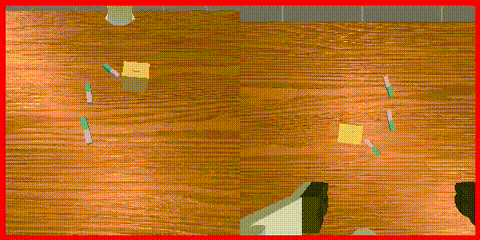
- **Draw Pattern**: 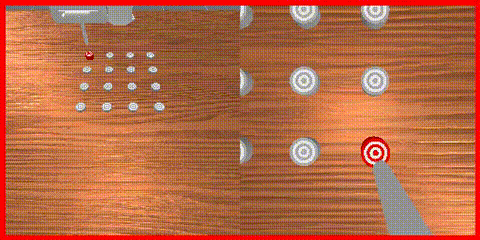
- **Route Stick**: 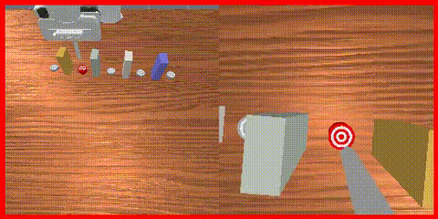

## Real World Application
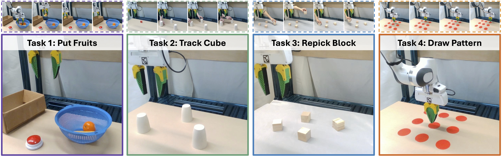
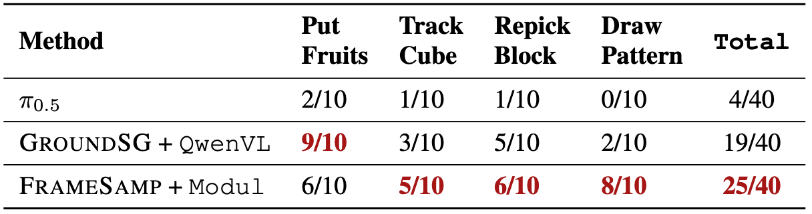
