# Articraft: An Agentic System for Scalable Articulated 3D Asset Generation

---

## Slide 1: Title

# Articraft: An Agentic System for Scalable Articulated 3D Asset Generation

**Authors**: Matt Zhou¹, Ruining Li², Xiaoyang Lyu¹, Zhaomou Song¹, Zhening Huang¹, Chuanxia Zheng³, Christian Rupprecht², Andrea Vedaldi², Shangzhe Wu¹

**Affiliations**: 
- ¹University of Cambridge
- ²University of Oxford
- ³Nanyang Technological University

**Project**: [articraft3d.github.io](https://articraft3d.github.io/)

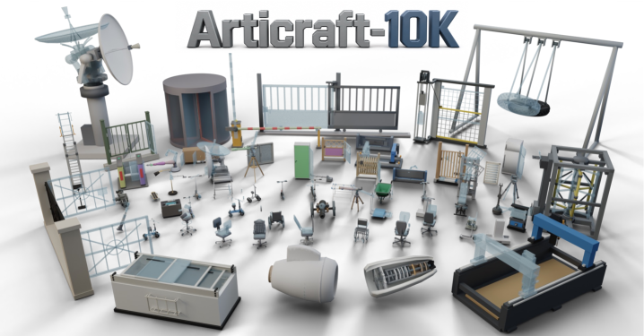

---

## Slide 2: The Problem

### Bottleneck in Articulated 3D Understanding

**Data Scarcity**: Existing datasets are small, narrow in coverage, and uneven in quality

| Dataset | Categories | Assets | Source |
|---------|------------|--------|---------|
| PartNet-Mobility | 46 | 2.3K | PartNet |
| AKB-48 | 48 | 2.0K | Real scanning |
| GAPartNet | 27 | 1.2K | PartNet-Mobility, AKB-48 |
| GRScenes | 22 | 1.8K | Human artist design |
| Infinigen-Sim | 20 | 20K | Procedural generation |
| PhysXNet | 24 | 26K | PartNet |
| PhysXNet-XL | 11 | 6M | Procedural generation |
| PhysX-Mobility | 47 | 2K | PartNet-Mobility |
| RoboCasa365 | 12 | 0.5K | Human artist design |

**Key Insight**: Learning-based methods overfit available data and fail to generalize to new categories

---

## Slide 3: Our Solution

### Articraft: Agentic System for Scalable Generation

**Core Idea**: Reduce articulated 3D asset generation to program writing

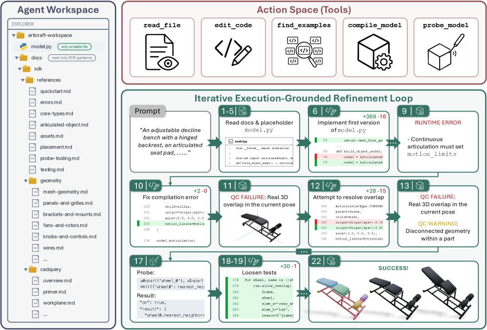

**Three Principles**:
1. **Automatic**: Given object description → produces articulated asset without manual intervention
2. **Lightweight**: Avoids heavy external graphics software (e.g., Blender) and image-based feedback
3. **Expressive**: Covers wide range of articulated categories, including complex mechanisms

---

## Slide 4: Technical Innovation

### Two Key Components

**1. LLM-Friendly SDK**
- Focused, expressive, and LLM-friendly
- Spans wide range of articulated categories
- Close enough to familiar coding patterns for reliable generation
- Exposes both low-level primitives (e.g., adding a cylinder) and high-level abstractions (e.g., adding a hinge)
- Lets LLM write and execute object-specific validation code

**2. Agent Harness**
- Turns LLM into iterative agent rather than single-pass generator
- Exposes minimal workspace and interface:
  - Edit a single program
  - Execute it
  - Receive/request feedback on resulting 3D asset
- Encodes deliberate choices about context exposure, structure, validation, and stopping criteria

---

## Slide 5: Articraft-10K Dataset

### Scale and Diversity

**10,000+ Articulated Assets** spanning **245 categories**

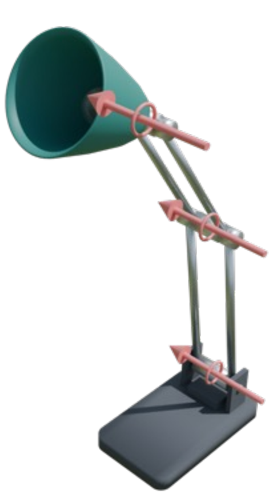

**Key Statistics**:
- **15 super-categories**: Tools, Furniture, Vehicles, Electronics, Household, etc.
- **91.7% retention rate** after manual curation (rated 4 or 5)
- **$1.14 per generated attempt** on average
- **No GPU required** for generation - CPU-only pipeline

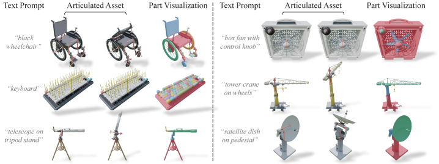

---

## Slide 6: Generation Process

### How Articraft Works

1. **Input**: Text description of articulated object
2. **LLM writes program** against our SDK
3. **Program executes** → produces articulated asset
4. **Validation**: Automated tests check structural integrity
5. **Feedback loop**: LLM iteratively refines based on feedback
6. **Output**: Complete articulated 3D asset with URDF

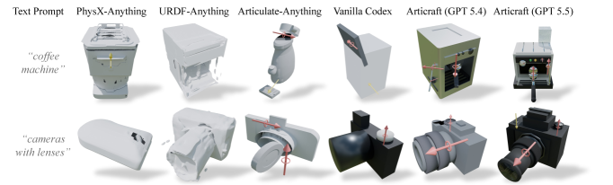

**Key Advantage**: LLM focuses on object design, not software details

---

## Slide 7: Quality and Validation

### Automated Quality Control

**Validation Pipeline**:
- **Structural integrity**: Parts connect properly, joints function correctly
- **Motion validation**: Range of motion is physically plausible
- **Geometry checks**: No self-intersections, proper mesh topology
- **Functional tests**: Object-specific validation code

**Manual Curation**:
- **91.7% retention rate** across all backends
- **GPT-5.5**: 95.5% retention
- **GPT-5.4**: 89.4% retention
- **Gemini 3.1 Pro**: 96.3% retention

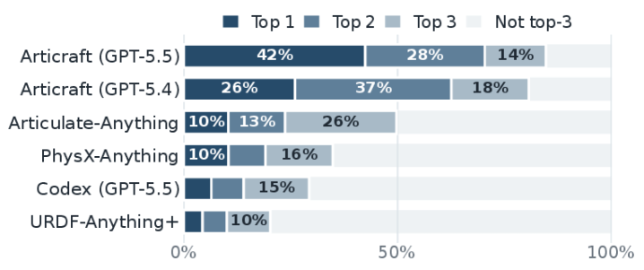

---

## Slide 8: Applications

### Downstream Uses

**1. Robotics Simulation**
- Train manipulation policies on diverse articulated objects
- Test generalization to unseen categories
- Evaluate robustness to variations

**2. Virtual Reality**
- Interactive 3D environments with functional objects
- Realistic physics-based interactions
- Scalable content generation for VR applications

**3. 3D Content Creation**
- Automated generation of articulated assets for games
- Rapid prototyping of mechanical designs
- Digital twin creation

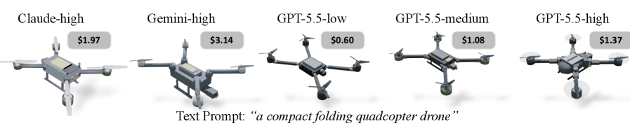

---

## Slide 9: Performance Comparison

### State-of-the-Art Results

**Outperforms**:
- Prior articulated asset generators
- General-purpose coding agents (Codex, Claude Code)
- Traditional procedural generation methods

**Key Metrics**:
- **Higher quality** assets across diverse categories
- **Lower computational cost** (no GPU required)
- **Faster generation** (lightweight pipeline)
- **Better generalization** to new categories

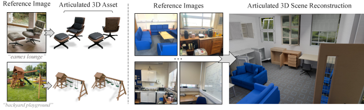

---

## Slide 10: Case Studies

### Example Generated Assets

**Complex Mechanisms**:
- **Folding chairs**: Multiple joints, nested hierarchies
- **Pliers**: Symmetric parts, coordinated motion
- **Desk lamps**: Adjustable arms, multiple degrees of freedom
- **Strollers**: Complex kinematic chains, safety mechanisms

**Everyday Objects**:
- **Cabinets**: Doors, drawers, shelves
- **Tools**: Wrenches, screwdrivers, pliers
- **Furniture**: Tables, chairs, desks
- **Electronics**: Laptops, tablets, phones

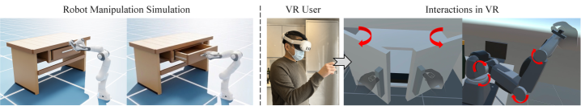

---

## Slide 11: Technical Architecture

### SDK Design

**Low-Level Primitives**:
- `add_cylinder(radius, height)`
- `add_box(width, height, depth)`
- `add_sphere(radius)`
- `set_material(color, texture)`

**High-Level Abstractions**:
- `add_hinge(axis, origin, range)`
- `add_slider(direction, limits)`
- `add_joint(type, parameters)`
- `connect_parts(parent, child, joint)`

**Validation Framework**:
- `test_motion_range()`
- `check_collisions()`
- `verify_connectivity()`
- `validate_physics()`

---

## Slide 12: Agent Harness

### Iterative Refinement

**Workspace Design**:
- **Single program focus**: LLM edits one program at a time
- **Minimal interface**: Edit → Execute → Feedback
- **Structured feedback**: Error messages, validation results, suggestions
- **Context management**: Deliberate choices about what to expose

**Stopping Criteria**:
- **Success threshold**: All validation tests pass
- **Iteration limit**: Maximum number of refinement steps
- **Time budget**: Cost constraints per asset
- **Quality score**: Manual or automated rating

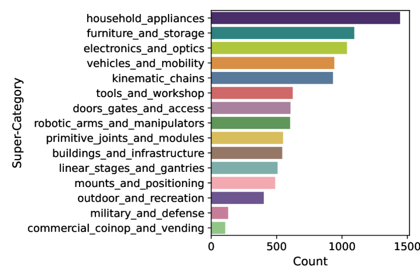

---

## Slide 13: Dataset Statistics

### Articraft-10K Details

**Generation Cost**:
- **Total API cost**: ~$12.39K
- **Per-object cost**: ~$1.14
- **Average turns**: 3-5 iterations per object
- **Wall-clock time**: Dominated by LLM API latency

**Compute Requirements**:
- **CPU-only pipeline**: No GPU needed for generation
- **Parallelizable**: Each object generated independently
- **Memory efficient**: Worker memory determined by single object state
- **Scalable**: Distribute across CPU workers

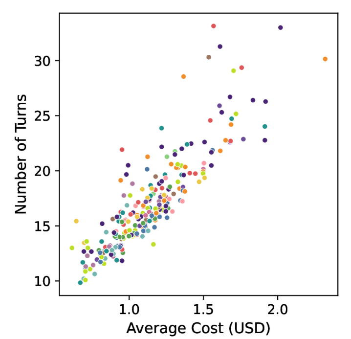

---

## Slide 14: Impact on Robotics

### Enabling Generalization

**Training Benefits**:
- **Diverse training data**: 245 categories vs. typical 10-20
- **Realistic variations**: Natural diversity in geometry and articulation
- **Functional diversity**: Different motion types, joint configurations
- **Scale**: 10K+ assets enables data-hungry learning methods

**Downstream Tasks**:
- **Part segmentation**: Identify movable vs. fixed parts
- **Joint prediction**: Estimate joint types, axes, ranges
- **Motion planning**: Plan manipulation sequences
- **Simulation training**: Train policies in realistic environments

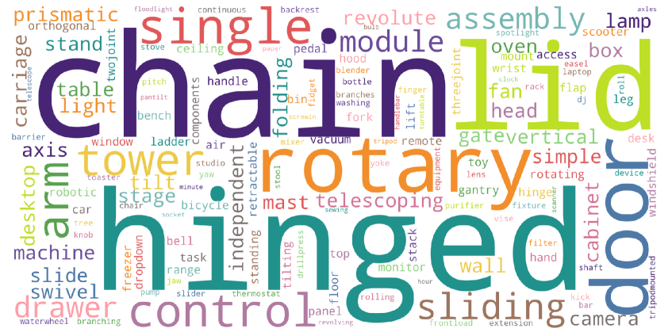

---

## Slide 15: Future Directions

### Research Opportunities

**1. Improved Generation**
- Better handling of complex mechanisms
- More realistic geometry and materials
- Improved motion simulation

**2. Enhanced Validation**
- More sophisticated automated tests
- Physics-based validation
- User-in-the-loop feedback

**3. Expanded Applications**
- Robotics simulation at scale
- VR/AR content generation
- Digital twin creation
- Educational tools

**4. Integration with Learning**
- Fine-tuning on Articraft-10K
- Domain adaptation to real-world data
- Transfer learning to new domains

---

## Slide 16: Demo

### Interactive Examples

**[Try Articraft Online](https://articraft3d.github.io/)**

**Example Categories**:
- Tools: Pliers, Wrench, Screwdriver
- Furniture: Chair, Table, Cabinet
- Vehicles: Car, Bicycle, Stroller
- Electronics: Laptop, Tablet, Phone
- Household: Lamp, Fan, Blender

**Interactive Features**:
- Manipulate generated objects
- Test motion ranges
- Explore part hierarchies
- View URDF structure

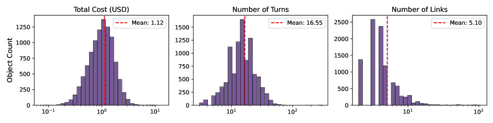

---

## Slide 17: Code and Data

### Open Source Release

**Available Resources**:
- **Articraft-10K Dataset**: 10K+ articulated assets
- **Code representations**: All asset programs
- **Agent reasoning traces**: LLM thought processes
- **Agent environment**: Reusable with different LLM backends
- **SDK**: Programmatic interface for asset generation
- **Harness**: Iterative refinement framework

**License**: Academic and commercial use permitted

**Citation**: 
```
@article{zhou2026articraft,
  title={Articraft: An Agentic System for Scalable Articulated 3D Asset Generation},
  author={Zhou, Matt and Li, Ruining and Lyu, Xiaoyang and Song, Zhaomou and Huang, Zhening and Zheng, Chuanxia and Rupprecht, Christian and Vedaldi, Andrea and Wu, Shangzhe},
  journal={arXiv preprint arXiv:2605.15187},
  year={2026}
}
```

---

## Slide 18: References

### Key Papers

1. **Zhou et al. (2026)**. "Articraft: An Agentic System for Scalable Articulated 3D Asset Generation." *arXiv:2605.15187*.

2. **PartNet-Mobility**. "PartNet-Mobility: A Large Benchmark Dataset for Robot Manipulation of Articulated Objects." *CoRL 2021*.

3. **AKB-48**. "AKB-48: A Large-Scale Dataset for Articulated Object Understanding." *CVPR 2023*.

4. **GAPartNet**. "GAPartNet: A Dataset for Generalizable Articulated Object Understanding." *ICCV 2023*.

5. **GRScenes**. "GRScenes: A Dataset for Generalizable Robot Manipulation." *RSS 2023*.

6. **Infinigen-Sim**. "Infinigen-Sim: A Dataset for Simulated Robot Manipulation." *CoRL 2022*.

7. **PhysXNet**. "PhysXNet: A Dataset for Physics-Based Robot Manipulation." *ICRA 2023*.

8. **PhysXNet-XL**. "PhysXNet-XL: Scaling Physics-Based Robot Manipulation." *CoRL 2023*.

9. **PhysX-Mobility**. "PhysX-Mobility: A Dataset for Mobile Robot Manipulation." *RSS 2023*.

10. **RoboCasa365**. "RoboCasa365: A Dataset for Household Robot Manipulation." *ICRA 2023*.

---

## Slide 19: Q&A

### Questions?

**Contact**: 
- Matt Zhou (Project Lead): matt.zhou@cam.ac.uk
- Shangzhe Wu: shangzhe.wu@cam.ac.uk

**Resources**:
- Project Page: [articraft3d.github.io](https://articraft3d.github.io/)
- Paper: [arXiv:2605.15187](https://arxiv.org/abs/2605.15187)
- Dataset: [Articraft-10K](https://articraft3d.github.io/dataset)
- Code: [GitHub](https://github.com/articraft3d/articraft)

**Thank You!**

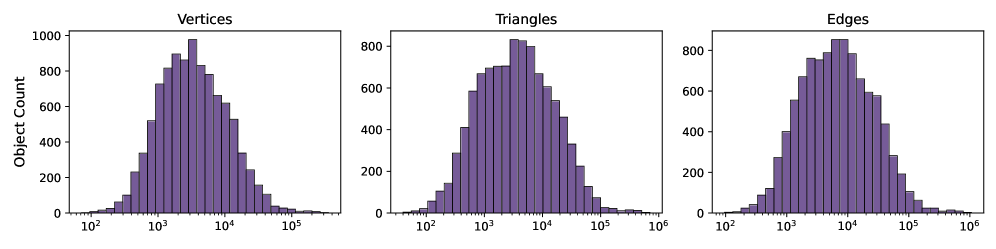
