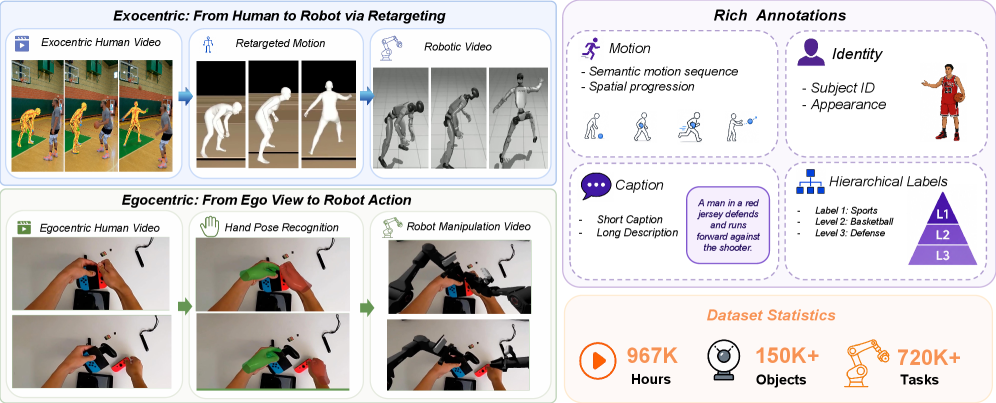
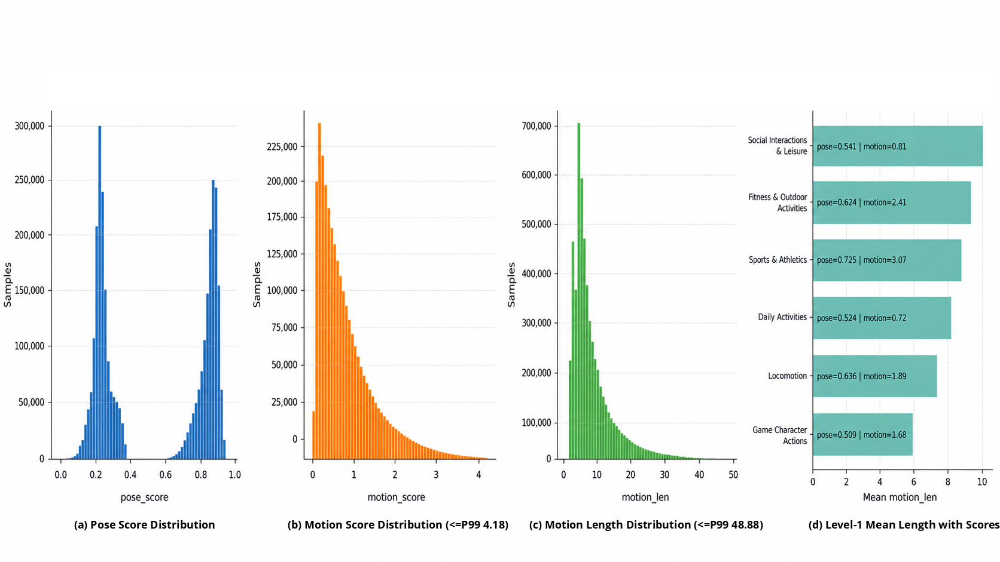
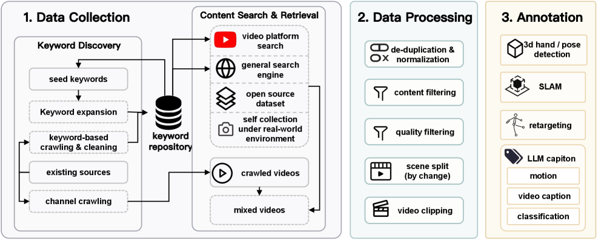
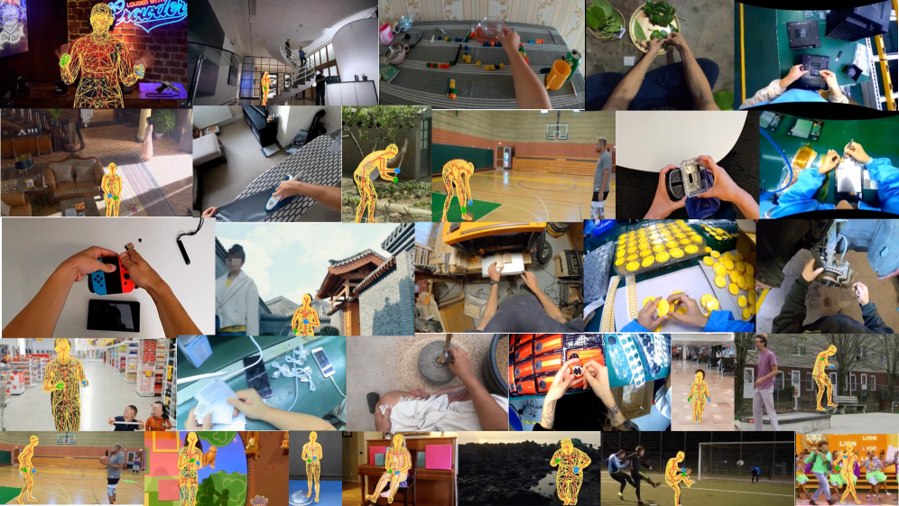
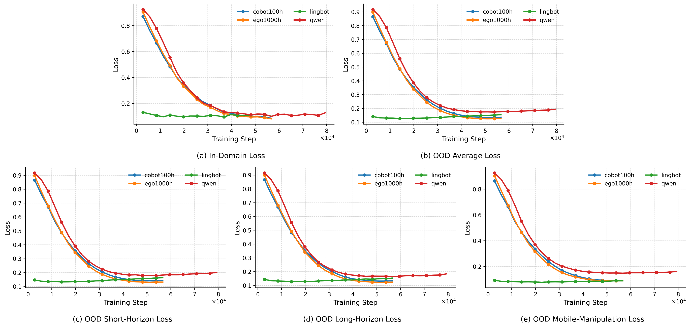

# HumanNet: Scaling Human-Centric Video Learning to One Million Hours

> **Authors:** Yufan Deng, Daquan Zhou (Peking University)  
> **Published:** May 2026 | arXiv: [2605.06747](https://arxiv.org/abs/2605.06747)  
> **Project Page:** [dagroup-pku.github.io/HumanNet](https://dagroup-pku.github.io/HumanNet/)  
> **GitHub:** [DAGroup-PKU/HumanNet](https://github.com/DAGroup-PKU/HumanNet)  
> **Dataset:** [HuggingFace — DAGroup-PKU/HumanNet](https://huggingface.co/datasets/DAGroup-PKU/HumanNet)  
> **License:** Apache 2.0

---

## Overview

**HumanNet** is a **one-million-hour** human-centric video corpus designed as scalable infrastructure for fine-grained activity understanding, motion-aware video learning, and embodied pretraining. It is the largest human-centric video dataset to date.

HumanNet pairs **first-person (egocentric)** and **third-person (exocentric)** footage with caption labels, motion annotations, and hand and body signals, organized by a multi-axis taxonomy and produced by a curation pipeline that treats human-centric filtering, viewpoint characterization, quality control, and privacy review as first-class design choices.

### Teaser


### Demo Video


---

## Abstract

Progress in embodied intelligence increasingly depends on scalable data infrastructure. While vision and language have scaled with internet corpora, learning physical interaction remains constrained by the lack of large, diverse, and richly annotated human activity data.

HumanNet spans both first-person and third-person perspectives and covers fine-grained activities, human-object interactions, tool use, and long-horizon behaviors across diverse real-world environments. Beyond raw video, the dataset provides interaction-centric annotations — including captions, motion descriptions, and hand and body-related signals — enabling motion-aware and interaction-aware learning.

Under a controlled vision-language-action post-training protocol, initializing from **1,000 hours of egocentric video** drawn from HumanNet **matches or modestly surpasses** initializing from **100 hours of real-robot data** and substantially closes the gap to a **20,000-hour real-robot baseline**, indicating that egocentric human video is a scalable and cost-effective substitute when robot data is limited.

---

## Figure 1: Overview of HumanNet



*Left:* Two viewpoint-specific bridges from human video to robot supervision — exocentric video is converted into robot motion through retargeting, while egocentric video is paired with hand pose for manipulation transfer.

*Right:* Each clip is enriched with motion, identity, caption, and hierarchical-label annotations, and the corpus is summarized by headline statistics on duration, object diversity, and task coverage.

---

## Key Statistics



| Metric | Value |
|---|---|
| Total Duration | ~967,000 hours (~1 million hours) |
| Perspectives | First-person (egocentric) + Third-person (exocentric) |
| Annotations | Captions, motion descriptions, hand pose, body signals |
| Taxonomy | Multi-axis (activities, objects, environments, viewpoints) |

---

## Curation Pipeline

HumanNet introduces a systematic data curation paradigm for embodied learning:

1. **Human-Centric Filtering** — Selecting videos that prominently feature human activity and interaction with the physical world.
2. **Temporal Structuring** — Segmenting raw video into meaningful clips with coherent activity boundaries.
3. **Viewpoint Characterization** — Classifying and balancing first-person vs. third-person perspectives.
4. **Annotation Enrichment** — Adding captions, motion descriptions, hand/body pose signals, and hierarchical labels.
5. **Quality Control** — Filtering for visual quality, audio clarity, and annotation consistency.
6. **Privacy Review** — Redacting sensitive content, license review, and restricted-content filtering.





---

## Validation Results

The authors conducted a controlled vision-language-action (VLA) ablation study:

- **Base model:** Qwen VLM
- **Protocol:** Fixed policy architecture and downstream validation corpus; varied only the pretraining source
- **Comparison:** 1,000 hours of egocentric HumanNet video vs. 100 hours of real-robot data (Magic Cobot) vs. 20,000 hours of real-robot baseline



**Key findings:**
- The egocentric-pretrained variant consistently narrows the gap between generic web-scale language-vision initialization and robot-specialized initialization.
- First-person human video captures actor-centered cues, hand-object contact patterns, and procedural structure that remain useful after transfer to robot post-training.
- The model initialized with 1,000 hours of egocentric video **matches and on several task groups slightly surpasses** the model initialized with 100 hours of real-robot CoBot data.

---

## Downstream Applications

HumanNet is designed to support multiple downstream uses:

- **Video & VLM Pretraining** — Stronger human activity, contact, and motion structure than generic internet video.
- **World-Action Model Training** — Jointly capturing environment dynamics and the actions that drive them.
- **Motion-Aware Representation Learning** — Aligning appearance, language, and motion across both viewpoints.
- **Human-to-Robot Transfer** — Widening the human side of the transfer pipeline in scale and scene diversity.
- **Multimodal Objectives for Physical AI** — Masked/predictive video modeling, language-video alignment, procedural boundary prediction, weakly supervised hand-object learning, pose/motion prediction, and caption-conditioned activity modeling.

---

## Related Work & Context

HumanNet builds on and extends prior efforts:

| Dataset | Focus |
|---|---|
| [Ego4D](https://ego4d-data.org/) | Egocentric video understanding |
| [EPIC-KITCHENS](https://epic-kitchens.github.io/) | Egocentric kitchen activities |
| [Ego-Exo4D](https://ego-exo4d.github.io/) | Paired first/third-person views |
| [EgoScale](https://egomimic.github.io/) | Scaling egocentric data for manipulation |
| [EgoVerse](https://egoverse.github.io/) | Shared ecosystem for egocentric robot data |
| [EgoMimic](https://egomimic.github.io/) | Co-training imitation on human + robot data |
| [OpenX](https://robotics-transformer-x.github.io/) | Robot learning datasets |
| [HowTo100M](https://www.di.ens.fr/willow/howto100m/) | Instructional video |

---

## Limitations & Ethics

- **Embodiment gap:** Human behavior is not robot behavior. The corpus provides transferable priors, not direct replacement for robot data.
- **Noise at scale:** Ambiguous labels, inconsistent task boundaries, missing metadata, and variable visual quality are inevitable.
- **Coverage bias:** Potential bias toward certain geographies, socioeconomic contexts, occupations, viewpoints, and body types.
- **Privacy & safety:** First-person recordings may capture bystanders, sensitive interiors, private documents, or proprietary workflows. Any release includes license review, redaction policy, and restricted-content filtering.
- **Dual-use:** The same data that accelerates assistive systems and robotic manipulation may strengthen surveillance-adjacent perception systems.

---

## Acknowledgements

- **SimpleSilicon Innovation** — Funding and resource support
- **Astribot** — Real-robot platforms and deployment experiment support

---

## Citation

```bibtex
@article{deng2026humannet,
  title={HumanNet: Scaling Human-centric Video Learning to One Million Hours},
  author={Deng, Yufan and Zhou, Daquan},
  journal={arXiv preprint arXiv:2605.06747},
  year={2026}
}
```

---

## Links

- 📄 [Paper (arXiv)](https://arxiv.org/abs/2605.06747)
- 🌐 [Project Page](https://dagroup-pku.github.io/HumanNet/)
- 💻 [GitHub Repository](https://github.com/DAGroup-PKU/HumanNet)
- 📦 [Dataset (HuggingFace)](https://huggingface.co/datasets/DAGroup-PKU/HumanNet)
- 🤖 [StableVLA (ICML 2026)](https://github.com/DAGroup-PKU/HumanNet/tree/main/src/model/StableVLA) — Vision-Language-Action model for robust robot policy learning
- 📚 [Datasets Listing](https://github.com/roatienza/autonomous-robots#datasets) — Broader collection of datasets for autonomous robots
