# Flow Matching and Diffusion Models

**Author**: Rowel Atienza, PhD  
**Institution**: University of the Philippines  
**Year**: 2025  
**Source**: [Flow_and_Diffusion.pdf](https://drive.google.com/file/d/16nYQnJlKJMPRRhzOSQyBAMCq_Vb3OWeS/view)

---

## 1. Problem Formulation

### Core Concepts

- **p_data** — data distribution (target distribution)
  - Example: images of a dog, voice of a famous actor, etc.
  - Generation/sampling: **y** ∈ ℝᴰ ~ p_data

- **p_init** or **p_noise** — noise distribution (initial/source distribution)
  - Example: Gaussian distribution
  - Sampling: **x** ∈ ℝᴰ ~ p_init

### The Problem

Transform noise samples to data samples:

**p_init → p_data** or **x** ∈ ℝᴰ at t=0 → **y** ∈ ℝᴰ at t=1

### Training and Inference

- **Training**: y₁, y₂, …, yₙ ~ p_data (dataset)
- **Inference**: y ~ p_data
- **Φ**: a neural network generating p_data

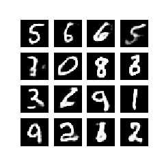

---

## 2. Flow Models

### Ordinary Differential Equations (ODEs)

A solution to ODE is defined by a trajectory:

**k**: [0,1] → ℝᴰ, t → k(t)

At any time t, we know how k is mapped to k(t).

### Vector Field (Velocity)

Every ODE is defined by a vector field:

**u**: ℝᴰ × [0,1] → ℝᴰ, (x,t) → u(t,x)

For every location **x** and time t, we get a velocity in space u(t,x) ∈ ℝᴰ.

### Trajectory

We want a vector field that follows a line starting at x₀:

```
dk(t)/dt = u(t, k(t))    [ODE]
k(0) = x₀                 [initial condition]
```

### Flow

If we start at k₀ = x₀ at t = 0, where are we at time t?

**Φ**: ℝᴰ × [0,1] → ℝᴰ, (x₀, t) → Φ(t, x₀), k(t) = Φ(t, k₀)

```
dΦ(t, x₀)/dt = u(t, Φ(t, x₀))    [flow ODE]
Φ(0, x₀) = x₀                     [initial condition]
```

### ODE Simulation – Euler Method

```
k(t+h) = k(t) + h·u(t, k(t))
for t = 0, h, 2h, … 1-h
where h = 1/n (step size), n ∈ ℕ
```

### Flow Model Architecture

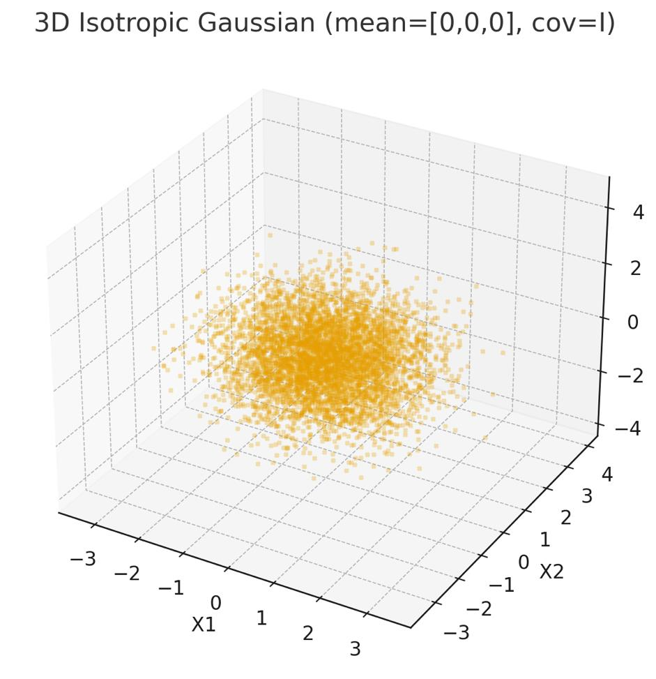

- **k₀** ~ p_init
- **dk(t)/dt = u_Φ(k(t))** where Φ are neural network parameters
- Goal: k₁ ~ p_data, where k₁ = Φ₁_Φ(k₀)

**Note**: The neural network predicts the **velocity** instead of the flow!

---

## 3. Diffusion Models

### Key Distinction

| Flow Models | Diffusion Models |
|:-----------:|:----------------:|
| Deterministic | Stochastic |
| ODEs | SDEs |

### Stochastic Process

- **k(t)** for 0 ≤ t ≤ 1 is a random variable
- **k**: [0,1] → ℝᴰ, t → k(t) is a random trajectory for every draw

### Brownian Motion

- ODEs are constructed by a Gaussian Process
- SDEs are constructed by Brownian Motion
- A Brownian Motion **W(t)** for 0 ≤ t ≤ 1 is stochastic such that W(0) = 0 and trajectories t → W(t) are continuous:
  - **Normal increments**: W(t) - W(s) ~ 𝒩(0, (t-s)·I) for 0 ≤ s < t
  - **Independent increments**: W(t₁) - W(t₀), …, W(tₙ) - W(tₙ₋₁) are independent

### SDE Simulation – Euler-Maruyama

```
k(t+h) = k(t) + h·u(t, k(t)) + σ(t)·[W(t+h) - W(t)] + O(h)
for t = 0, h, 2h, … 1-h
where σ(t) ≥ 0 is the diffusion coefficient
```

### Stochastic Differential Equation

```
dk(t) = u(t, k(t))dt + σ(t)dW(t)    [SDE]
k(0) = x₀                            [initial condition]
```

---

## 4. Flow Matching

### Conditional Flows

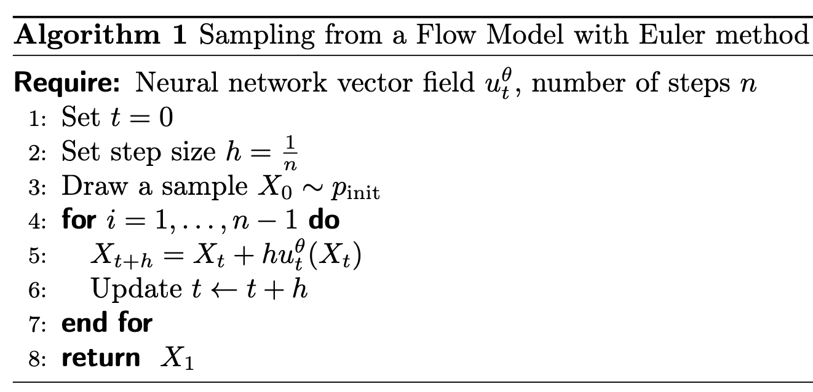

### Optimal Transport

Flow matching learns a vector field that transports probability mass from noise to data distribution.

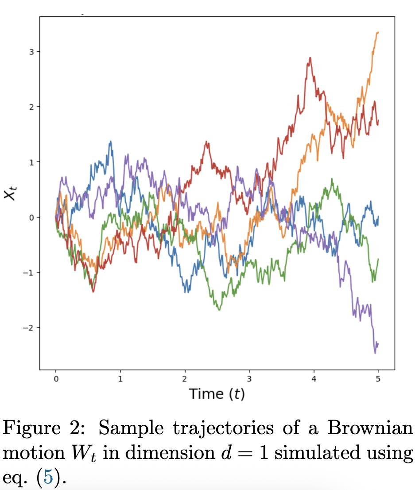

---

## 5. Diffusion Policy for Robotics

### Policy Representations

Three approaches to policy learning:

| Approach | Description |
|:--------:|:-----------|
| **Explicit Policy** | Direct mapping from observation to action (regression, categorical, mixture of Gaussians) |
| **Implicit Policy** | Learns energy function, optimizes for minimum energy |
| **Diffusion Policy** | Refines noise into actions via learned gradient field |

### Key Advantages of Diffusion Policy

- Handles **multimodal action distributions**
- Scales to **high-dimensional action spaces**
- **Stable training** without negative sampling
- Predicts **action sequences** for receding-horizon control

### Why Diffusion Policy?

| Challenge | Traditional Methods | Diffusion Policy |
|:---------:|:-------------------:|:----------------:|
| Multimodal Actions | Biased toward one mode (LSTM-GMM, IBC) | Expresses full distribution via Langevin dynamics |
| High-Dimensional Actions | Struggles with 6+ DoF | Naturally handles sequences of actions |
| Training Stability | Requires negative sampling (unstable) | Stable gradient-based training |
| Temporal Consistency | Myopic single-step planning | Receding-horizon control |

### Langevin Dynamics

Langevin dynamics is a stochastic process that combines:
- Gradient descent (`-∇U`)
- Gaussian noise (`√(2ε)·ξ`)

to sample from a target distribution. It's the mathematical foundation of Langevin Monte Carlo for Bayesian inference and diffusion models for generative AI.

**The reverse diffusion process is essentially Langevin dynamics with a neural network estimating the score function.**

### Main Idea

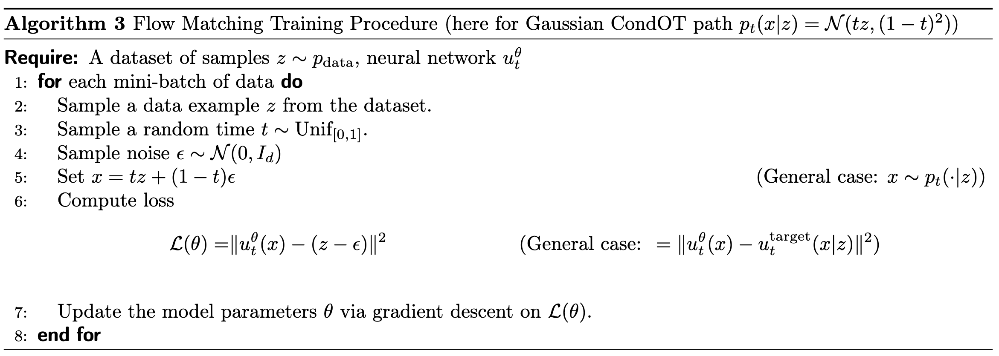

**Diffusion Policy**: p(Aₜ | Oₜ)
- **xₜ** or **aₜ** — actions (instead of image pixels in classic DDPM)
- **Oₜ** — observations as the condition
- Semi-closed-loop with chunks of {observations, actions}

### Training and Inference

**Training**:
```
L = E[||ε_k - ε_Φ(Oₜ, Aₜ⁰ + ε_k, k)||²]
```

**Inference**:
```
Aₜᵏ⁻¹ = Aₜᵏ - α·ε_Φ(Oₜ, Aₜᵏ, k) + 𝒩(0, σ²I)
```

### Model Architecture

| Component | Function |
|:---------:|:---------|
| Vision Encoder | Extract features from RGB images (end-to-end trained) |
| Action Encoder | Encode action sequences for diffusion process |
| Time Embedding | Inject timestep information into the model |
| Transformer | Process action sequences with temporal attention |
| Denoising Head | Predict noise to remove from current action estimate |

### Time-Series Diffusion Transformer

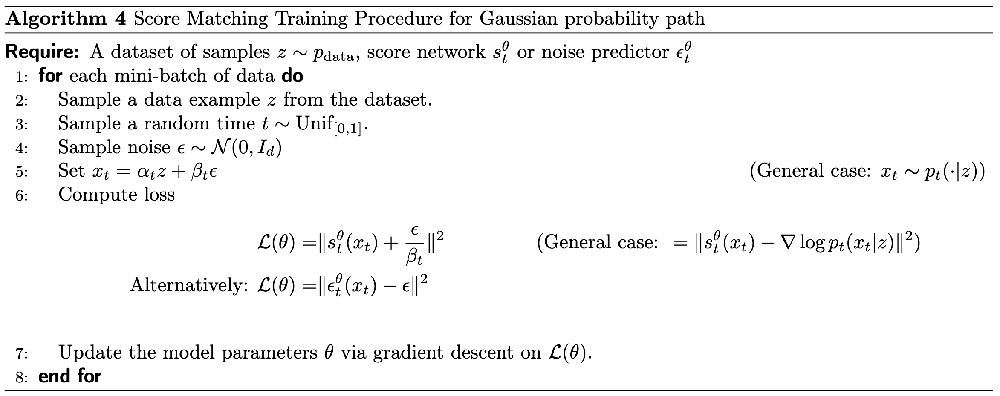

**Key Technical Contributions**:
- **Receding Horizon Control**: Predict action sequences, execute first action, re-plan
- **Visual Conditioning**: Extract visual features once, condition diffusion process
- **Time-Series Transformer**: Minimize over-smoothing effects of CNN-based models

### Receding Horizon Control

1. **Observe**: Get current visual observation
2. **Denoise**: Generate full action sequence via diffusion process
3. **Execute**: Execute first action in the sequence
4. **Re-plan**: Repeat from step 1 with new observation

### Benefits of Receding Horizon Control

- **Temporal Consistency**: Predicts smooth action sequences
- **Responsiveness**: Re-plans at every timestep
- **Robustness**: Corrects for perturbations and errors
- **Long-Horizon Planning**: Considers future actions when deciding current action

### Multimodal Action Distributions

Many robotic tasks have multiple valid ways to complete them:
- Reach around an obstacle from left or right
- Grasp an object with different orientations
- Choose between multiple valid paths

**Diffusion Policy's Solution**:
- Learns the full action distribution via score function
- Uses Stochastic Langevin Dynamics to sample from the distribution
- Commits to one mode within each rollout
- Avoids mode collapse common in mixture models

---

## 6. Results

### Benchmark Performance

| Method | Average Success Rate |
|:------:|:-------------------:|
| **Diffusion Policy** | **94.7%** |
| IBC | 47.8% |
| LSTM-GMM | 45.2% |
| BET | 38.1% |

**46.9% average increase in success rate** over traditional methods.

### Real-World Experiments

#### Push-T Task

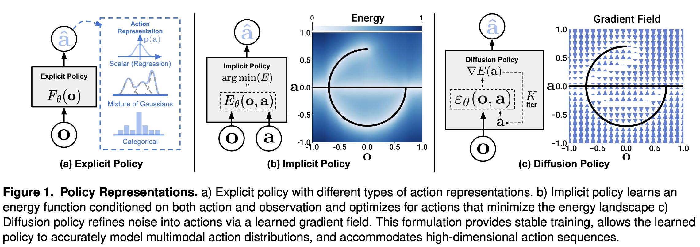

**Task**: Precisely push T-shaped block into target region, then move end-effector to designated end-zone.

**Hardware**:
- Robot: UR5 arm with Robotiq gripper
- Camera: Single RGB camera (front view)
- Control Frequency: 10 Hz (interpolated to 125 Hz for execution)

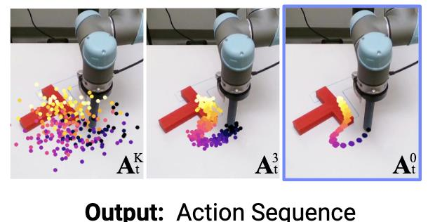

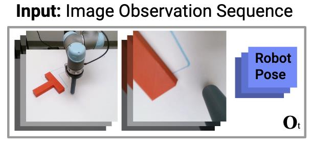

#### Mug Flipping

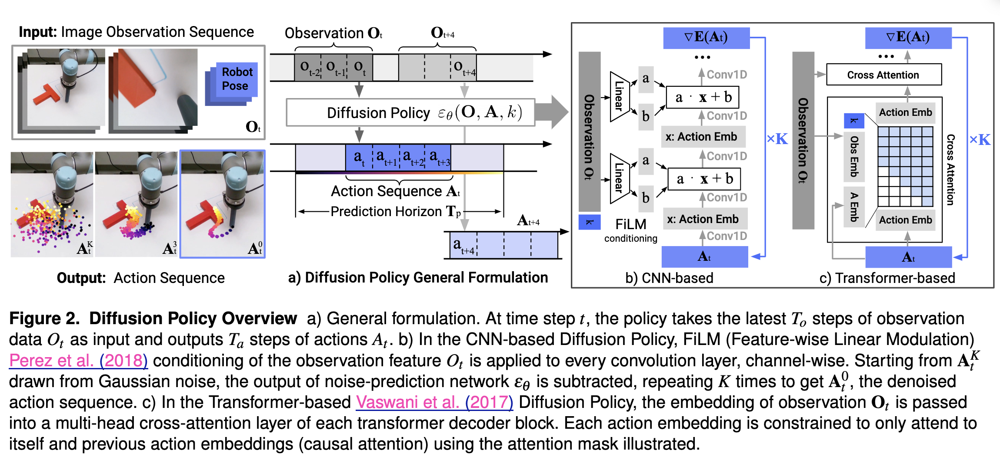

**Task**:
1. Pickup randomly placed mug
2. Place it lip-down (inverted)
3. Rotate handle to point left

#### Sauce Pouring & Spreading

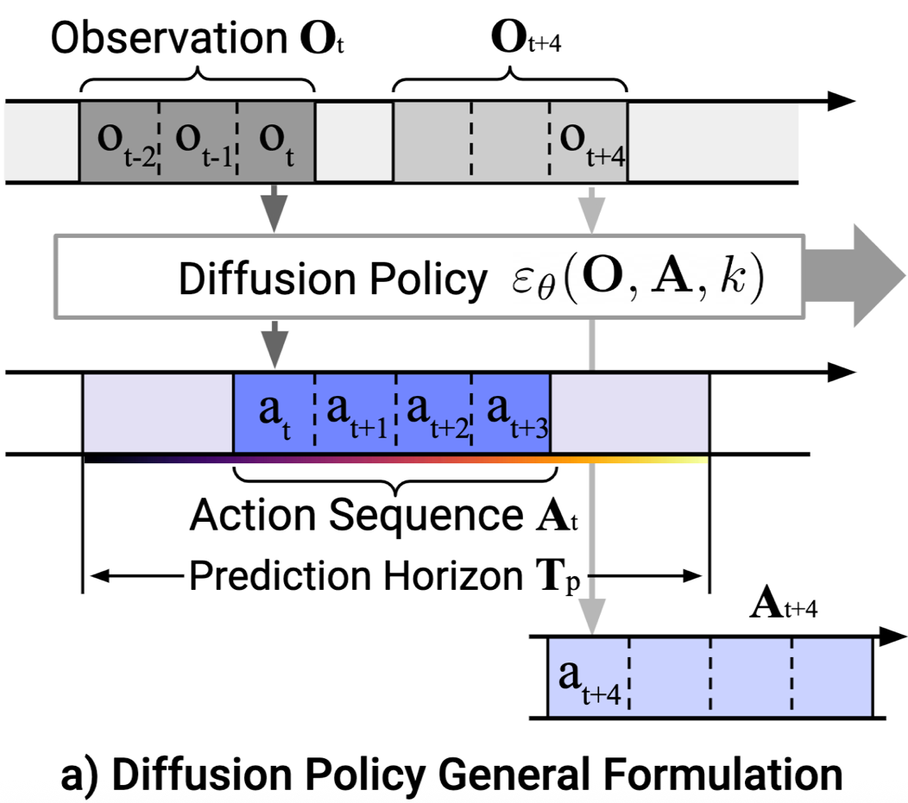

**Task**:
1. Manipulate liquid with 6 DoF periodic actions
2. Coordinate ladle/spoon movements
3. Handle fluid dynamics

---

## 7. Applications to Robot Learning

### Policy Learning

Diffusion models transform policy learning by:
- Modeling action distributions as denoising processes
- Enabling multi-modal action selection
- Providing temporal consistency through sequence prediction

### World Models

Flow matching and diffusion models can learn:
- State transition dynamics
- Observation generation from latent states
- Counterfactual reasoning through trajectory manipulation

### Data Augmentation

- Generate synthetic training data
- Simulate rare events and edge cases
- Create diverse scenarios for robust policy training

---

## References

1. Atienza, R. (2025). *Flow Matching and Diffusion Models*. University of the Philippines.
2. Holderrieth, P. & Erives, E. *An Introduction to Flow Matching and Diffusion Models*. https://diffusion.csail.mit.edu
3. Chi, C. et al. (2023). *Diffusion Policy: Visuomotor Policy Learning via Action Diffusion*. arXiv:2303.04137
4. Robomimic Benchmark Suite. https://github.com/ARISE-Initiative/robomimic
