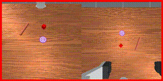

---
# 📖 NVIDIA Cosmos Cookbook
**Practical Implementation Guide for Physical AI**

**Links**: [NVIDIA Cosmos Cookbook](https://nvidia-cosmos.github.io/cosmos-cookbook/index.html)

---

## 🎯 Core Objective
- **Practical Deployment**: Moving world models from research papers to actual robotic implementations.
- **Tutorials & Examples**: Providing a structured path for developers to use the Cosmos ecosystem.
- **Physical AI**: Focusing on the intersection of generative AI and real-world physics.

---

## ⚙️ Key Technical Concepts
- **Implementation Recipes**: Step-by-step guides for deploying world models on NVIDIA hardware.
- **Ecosystem Integration**: How to combine different Cosmos tools for a complete robotics pipeline.
- **Optimization**: Techniques for making world models run efficiently in real-time.

---

## 🤖 Robotics Relevance
- **Developer Accessibility**: Lowering the barrier for researchers to use state-of-the-art world models.
- **Rapid Prototyping**: Allowing for quick setup of simulation environments.
- **Standardization**: Promoting a common set of tools and practices for Physical AI.

---

## 🖼️ Visuals

*Practical application of world models in robot manipulation.*

---
