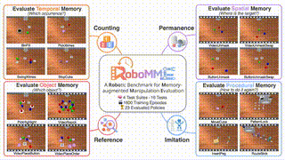

---
# 📽️ Nano World Models
**A Minimalist Implementation of Future Video Prediction**

**Links**: [GitHub](https://github.com/simchowitzlabpublic/nano-world-model) | [Project Page](https://simchowitzlabpublic.github.io/nano-world-model) | [arXiv](https://arxiv.org/abs/2605.23993)

---

## 📌 Core Objective
- **Minimalism**: Provides a compact, modular codebase for studying world-model design.
- **Focus**: Future video prediction centered around **diffusion forcing**.
- **Scope**: Designed for reproducibility across games and real-robot data.

---

## ⚙️ Key Technical Contributions
- **Unified Interface**: 
    - Supports various generative objectives.
    - Flexible model scales.
    - Diverse action-conditioning mechanisms.
- **Standardized Evaluation**: 
    - Framework for evaluating autoregressive rollout behavior.
- **Experimental Substrate**: 
    - Enables controlled studies on how prediction parameterization and domain complexity affect video quality.

---

## 🚀 Visual Demonstration

*Example of predictive rollouts in a robotic environment.*

---

## 🤖 Robotics Relevance
- **Rapid Prototyping**: Allows researchers to test new world-model architectures without massive compute.
- **Behavioral Analysis**: Helps in understanding how errors accumulate during long-horizon predictions.
- **Cross-Domain Utility**: Applicable to both synthetic (games) and physical (robot) data.
---
