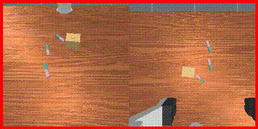

---
# 🏗️ Robot Learning from a Physical World Model
**Integrating Physical Laws into Latent Spaces**

**Links**: [arXiv](https://arxiv.org/pdf/2511.07416)

---

## 🎯 Core Objective
- **Physical Grounding**: Ensuring world models obey the laws of physics (gravity, friction, etc.).
- **Robustness**: Reducing "hallucinations" in generative models by constraining them with physical priors.
- **Generalization**: Improving the agent's ability to handle new objects by understanding their physical properties.

---

## ⚙️ Key Technical Concepts
- **Physical Priors**: Incorporating explicit physical equations into the loss function or architecture.
- **Constrained Latent Space**: Ensuring that transitions in the latent space correspond to physically possible movements.
- **Physics-Informed Learning**: Combining data-driven learning with classical physics-based simulation.

---

## 🤖 Robotics Relevance
- **Safety**: Ensuring the robot doesn't plan an action that is physically impossible or dangerous.
- **Precision**: Improving the accuracy of future state predictions for fine-grained manipulation.
- **Sample Efficiency**: Learning faster by not having to "discover" the laws of physics from scratch.

---

## 🖼️ Visuals

*Precision manipulation guided by physical world models.*

---
