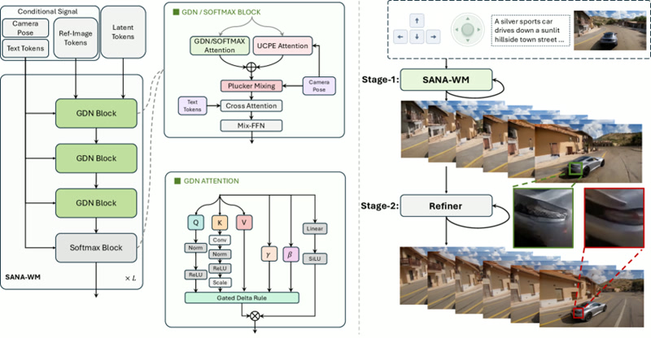
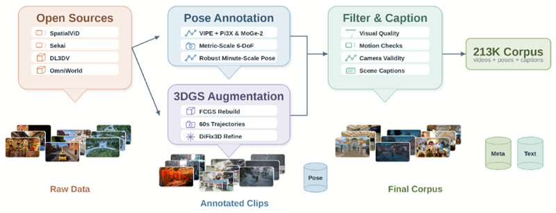
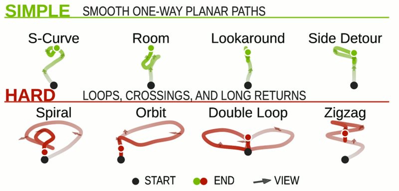
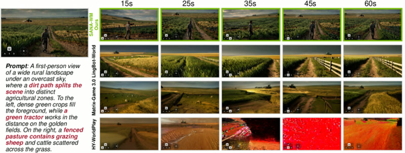
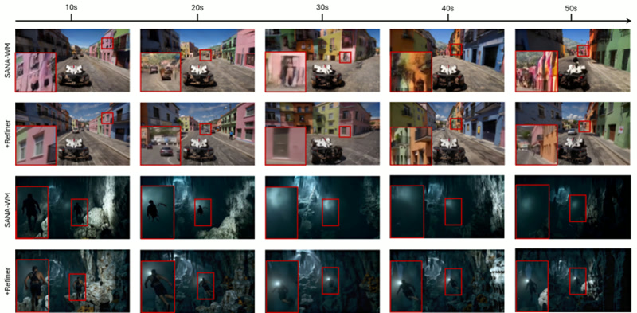
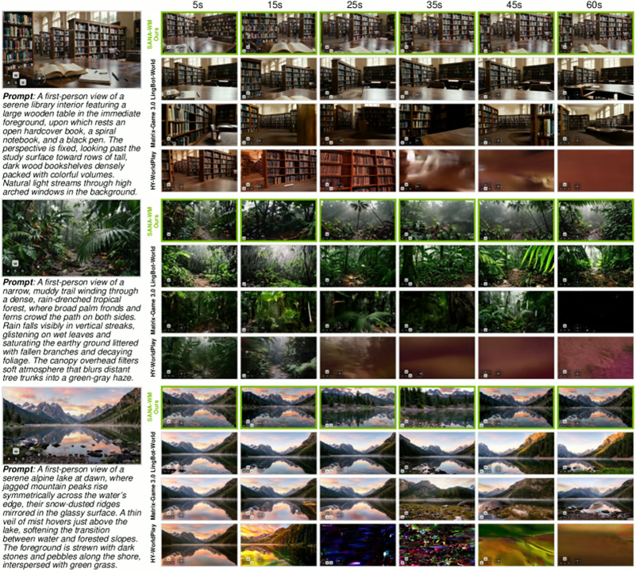
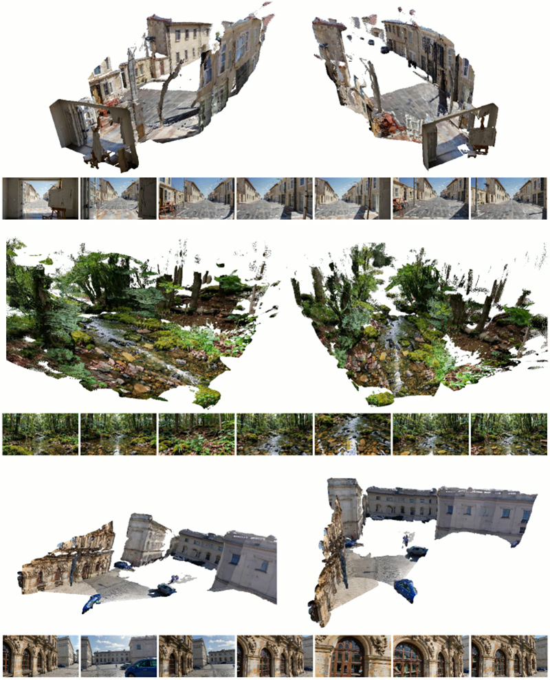

# SANA-WM: Efficient Minute-Scale World Modeling

> **Paper**: [SANA-WM: Efficient Minute-Scale World Modeling with Hybrid Linear Diffusion Transformer](https://arxiv.org/abs/2605.15178)
> **Authors**: Haoyi Zhu, Haozhe Liu, Yuyang Zhao, Tian Ye, Junsong Chen, Jincheng Yu, Tong He, Song Han, Enze Xie (NVIDIA)
> **Venue**: ICLR 2026 Oral
> **Project**: [nvlabs.github.io/Sana/WM/](https://nvlabs.github.io/Sana/WM/) | **Code**: [NVlabs/Sana](https://github.com/NVlabs/Sana) | **Models**: [HuggingFace](https://huggingface.co/collections/Efficient-Large-Model/sana)

---

## Overview

SANA-WM is a **2.6B-parameter open-source world model** that generates **720p, one-minute videos** from a single initial image and a 6-DoF camera trajectory. It achieves visual quality comparable to large-scale industrial baselines (LingBot-World, HY-WorldPlay) while delivering **36× higher throughput** and running inference on a **single GPU**.

*From one image and an action trajectory, SANA-WM generates minute-scale 720p worlds with precise camera control, 64-GPU training, and single-GPU inference.*

---

## Why It Matters for Robotics

| Capability | Relevance to Robotics |
|---|---|
| **6-DoF Camera Control** | Precise trajectory adherence — critical for robot navigation and SLAM simulation |
| **Minute-Scale Generation** | Long-horizon rollouts for planning and policy learning |
| **Single-GPU Inference** | Deployable on edge hardware and robot workstations |
| **34s for 60s clip (RTX 5090)** | Near real-time for simulation-based training |
| **Open-Source & Efficient** | Accessible to academic and startup research groups |

---

## Architecture

### Training & Inference Pipeline

*Training and inference pipeline. SANA-WM supports bidirectional generation for offline synthesis, chunk-causal autoregressive generation for sequential rollout, and distilled variants for fast deployment.*

### Four Core Designs

| # | Design | Purpose |
|---|---|---|
| **1** | **Hybrid Linear Attention** | Combines frame-wise Gated DeltaNet (GDN) with softmax attention for memory-efficient long-context modeling |
| **2** | **Dual-Branch Camera Control** | Latent-rate UCPE branch captures global trajectory; raw-frame Plücker mixing branch restores fine camera motion per VAE stride |
| **3** | **Two-Stage Generation** | Long-video refiner corrects structural artifacts and sharpens details across the full minute |
| **4** | **Robust Annotation Pipeline** | Extracts metric-scale 6-DoF camera poses from public videos using Pi3X + MoGe-2 depth fusion |

### Hybrid Linear DiT Backbone

*Hybrid Linear DiT backbone combining Gated DeltaNet blocks with periodic softmax attention for efficient long-context modeling.*

### Dual-Branch Camera Control

*Dual-rate camera conditioning: latent-rate UCPE for global trajectory structure, raw-frame Plücker mixing for fine-grained motion within each temporal VAE stride.*

---

## Efficiency

| Metric | SANA-WM | Prior Baselines |
|---|---|---|
| **Parameters** | 2.6B | 7B–15B |
| **Training Data** | ~213K clips | Millions |
| **Training Time** | 15 days on 64 H100s | Weeks to months |
| **Inference** | Single GPU | Multi-GPU clusters |
| **60s Clip Generation** | 34s (RTX 5090, NVFP4) | Minutes to hours |
| **Throughput** | **36× higher** | Baseline |

---

## Results

### Visual Quality Comparison

*Visual quality comparison between SANA-WM and baselines across long-horizon rollouts.*

### Benchmark Performance

*One-minute world-model benchmark results: SANA-WM achieves stronger action-following accuracy and comparable visual quality at significantly higher throughput.*

### Long-Horizon Rollout Quality

*Long-horizon rollout quality comparison. SANA-WM maintains scene consistency and visual fidelity across the full 60-second generation.*

### Refinement Ablation

*Quantitative comparison between SANA-WM and SANA-WM with the proposed refiner. The refiner improves visual fidelity, object structure, and temporal consistency across long sequences.*

---

## Applications to Robot SLAM and Physical Intelligence

### 1. Simulation-Based Policy Training

SANA-WM can generate **photorealistic, camera-controlled video sequences** from arbitrary viewpoints, providing synthetic training data for:
- Visual navigation policies
- Visual-inertial odometry (VIO) training
- Depth estimation and scene understanding

### 2. World Model for Planning

The **6-DoF camera control** enables robots to simulate the visual consequences of planned trajectories before execution:
- Predict what a robot will see after moving along a trajectory
- Evaluate multiple navigation plans in silico
- Reduce real-world trial-and-error in exploration

### 3. Data Augmentation for SLAM

Generate synthetic views of environments from sparse observations:
- Fill occluded regions with plausible geometry
- Augment training data for textureless or degenerate scenes
- Create diverse camera trajectories for robustness testing

### 4. Embodied AI Benchmarking

The **one-minute benchmark** (80 scenes, 4 types, 2 revisit trajectories each) provides a standardized evaluation framework for:
- Action-following accuracy
- Visual quality and temporal consistency
- Camera-motion fidelity

---

## Key Takeaways

1. **Efficiency is the breakthrough** — 2.6B parameters, single-GPU inference, 213K training clips. Democratizes world modeling for academic and startup research.

2. **Camera control is precise** — 6-DoF trajectory adherence makes it directly applicable to robot navigation and SLAM simulation.

3. **Long-horizon consistency** — Minute-scale generation with maintained visual quality addresses a critical gap in prior world models.

4. **Open-source and accessible** — Full code, models, and training recipes available. Deployable on consumer GPUs (RTX 5090) with NVFP4 quantization.

5. **Bridge to robotics** — While not a SLAM system itself, SANA-WM provides the generative prior and simulation capability that next-generation SLAM and embodied AI systems need.

---

## References

1. Zhu, H. et al. (2026). *SANA-WM: Efficient Minute-Scale World Modeling with Hybrid Linear Diffusion Transformer.* arXiv:2605.15178
2. [SANA-WM Project Page](https://nvlabs.github.io/Sana/WM/)
3. [NVlabs/Sana GitHub](https://github.com/NVlabs/Sana)
4. [HuggingFace Models](https://huggingface.co/collections/Efficient-Large-Model/sana)
