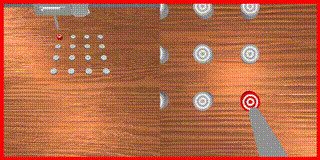

---
# 🎬 Wan2.2
**SOTA Video Generation for World Model Backbones**

**Links**: [GitHub](https://github.com/Wan-Video/Wan2.2)

---

## 🎯 Core Objective
- **Visual Dynamics**: Creating high-fidelity video sequences that capture complex physical movements.
- **Foundation Model**: Serving as a visual backbone for larger world models.
- **Synthetic Video Data**: Generating realistic training data for embodied AI.

---

## ⚙️ Key Technical Concepts
- **Diffusion Transformers**: Leveraging the power of DiT architectures for temporal consistency.
- **High-Resolution Synthesis**: Producing videos that maintain sharp details over time.
- **Action-Conditioned Generation**: (Potential) Using actions to steer the generated video sequence.

---

## 🤖 Robotics Relevance
- **Visual Simulation**: Providing a "visual world" that robots can use to predict future states.
- **Training Data**: Generating synthetic videos of robot interactions to pre-train policies.
- **Environmental Modeling**: Simulating how different objects and environments react to actions.

---

## 🖼️ Visuals

*High-fidelity visual dynamics for simulation.*

---
