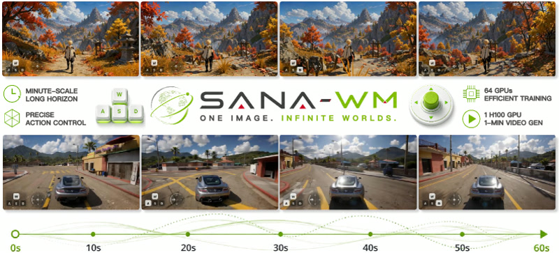

# World Models

This section provides a summary of the world models discussed in the research repository.

## SANA-WM: Efficient Minute-Scale World Modeling
SANA-WM is a 2.6B-parameter open-source world model capable of generating 720p, one-minute videos from a single image and a 6-DoF camera trajectory. It is highly efficient, offering 36x higher throughput than industrial baselines and supporting single-GPU inference.
- **Key Innovation**: Hybrid Linear Attention combining Gated DeltaNet with softmax attention.
- **Robotics Application**: Precise 6-DoF camera control for navigation, SLAM simulation, and policy training.
- **Impact**: Democratizes long-horizon world modeling by enabling high-quality generation on consumer hardware.

## NVIDIA Cosmos Reasoning
A research initiative by NVIDIA focusing on reasoning capabilities within world models to enhance the agent's ability to plan and interact with complex environments.

## DreamGen by NVIDIA
NVIDIA's generative model for creating high-fidelity synthetic environments and assets, facilitating the training of embodied AI agents in diverse scenarios.

## Genesis RoboGen
A framework for generating synthetic robotic data and environments, aiming to bridge the gap between simulation and reality for robot learning.

## Wan2.2
A high-performance video generation model that serves as a foundation for creating realistic visual dynamics used in world model simulations.

## Awesome World Models
A curated collection of resources, papers, and implementations related to world models, serving as a comprehensive guide for the research community.

## NVIDIA Cosmos Cookbook
A practical guide and set of examples for implementing and utilizing NVIDIA's Cosmos world model ecosystem.

## Robot Learning from a Physical World Model
Research exploring how robots can leverage models that explicitly incorporate physical laws to improve the accuracy and safety of their predictions.

## Nano World Model
A minimalist implementation of future video prediction, designed to be lightweight and efficient for rapid prototyping and research.

## Representation Learning to World Modeling
A discussion on the transition from learning static representations of the world to predicting dynamic future states (World Modeling).

## What are World Models - Nature
An overview of the concept of world models from a scientific perspective, published in Nature, explaining their role in cognitive science and AI.

## World Model for Robot Learning: A Comprehensive Survey
A comprehensive review of the current state of world models in robotics, detailing architectures, training methods, and application domains.

## Stable World Model
An implementation of a stable and consistent world model capable of maintaining long-term temporal coherence in generated sequences.

## Nano World
A minimalist approach to world modeling focusing on the core mechanics of future state prediction with minimal computational overhead.
